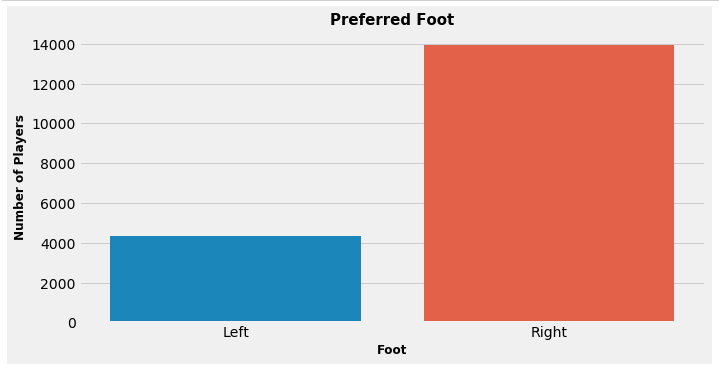
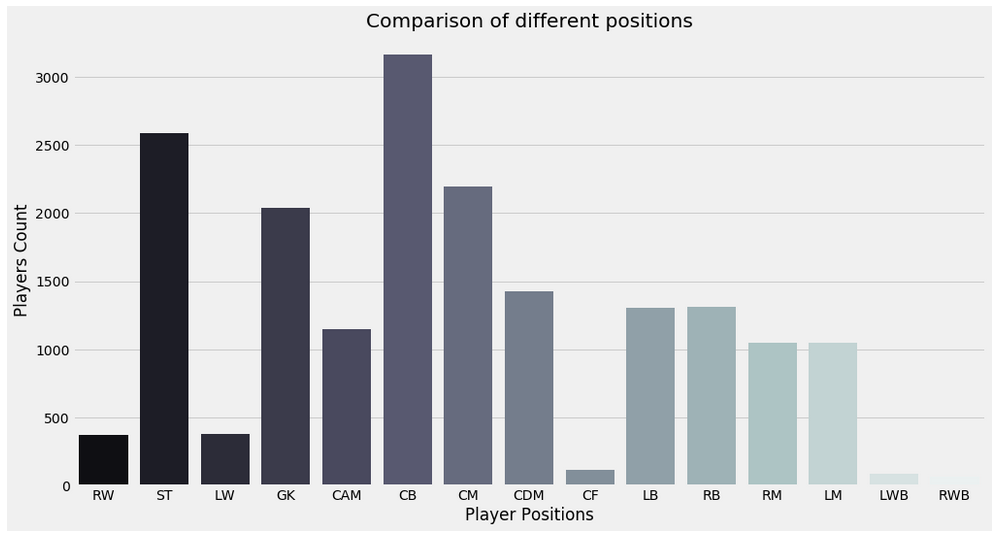
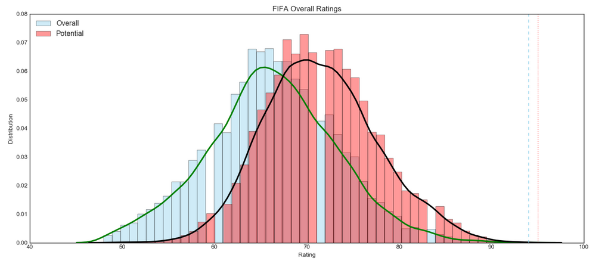
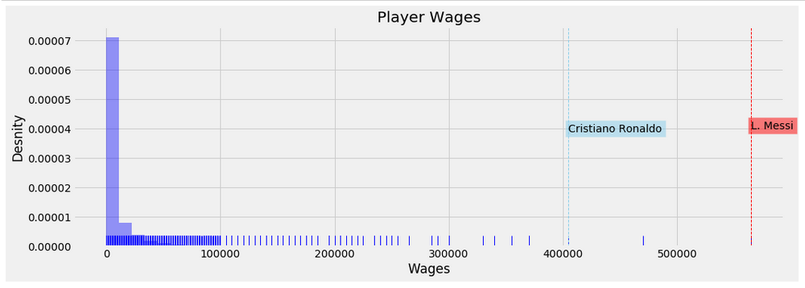
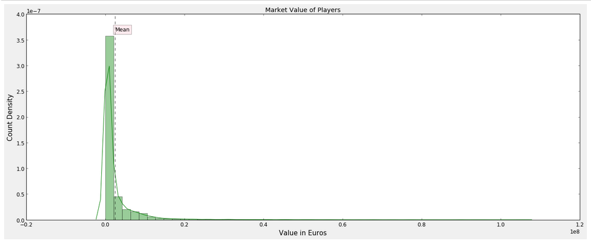
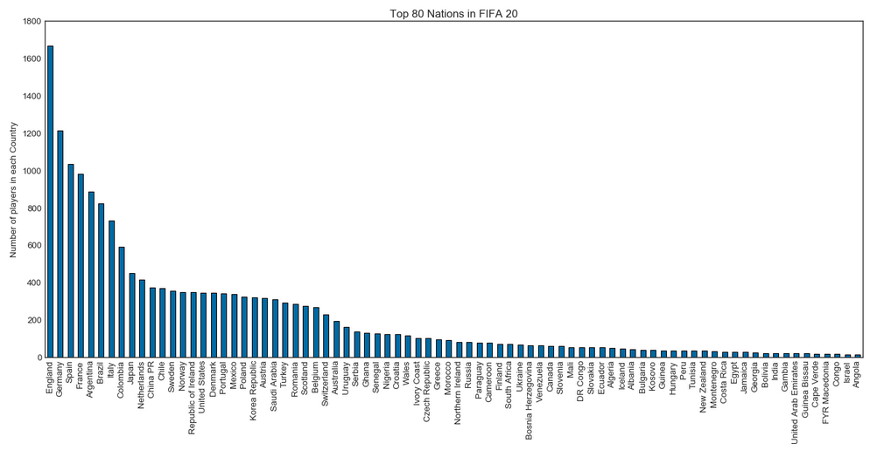

# Mini-projects on data science using python:
 
<h1 align=center>FIFA: Data analysis on FIFA datasets</h1>
<p align=center>(a work in progress)</p>


**Datasets can be obtained from:** 

```https://www.kaggle.com/stefanoleone992/fifa-20-complete-player-dataset```

## Prerequistes:
Seaborn needs to be installed to recreate the visuals. 
``` 
pip install seaborn
```

<h3><ins>Requirements:</ins></h3>
The project uses the standard data science libraries.

```python
import pandas
import numpy
import matplotlib.pyplot
```

## Results
<hr>
<h3>Foot preference for players.</h3>
<p>Some the best ever players are left-footed. They sure are rare!</p>

<br/>

<hr/>
<h3>Here is a look at the distribution of the various player positions</h3>
<p>Interesting to see the defensive positions take the lead in this distribution!</p>

<br/>

<hr/>
<h3>Now let's tke a look at FIFA ratings for players!</h3>

<p>Shows how majority of players of players lie around 65 and 70, for overall and potential ratings respectively. The far right is where the absolute ballers reside - some of the most elite atheletes in the world surely</p>
<br/>

<hr/>
<h3>A footballers (weekly) earnings ? - Madness :exploding_head:</h3>
<p>Footballers are some of the highest paid individuals on the planet. Even with weekly earnings that are only a dream to most, the sheer difference between the wages and market value of the best and the rest of them is astounding!</p>



***Yet another segment where Messi and Ronaldo stand clear of everyone else.:star_struck:***

(If only Ronaldo wasn't as old as he is - he would've been right up there with Messi on the wages and value charts!. Not that his performances are affected in any way. Truly a machine :mechanical_arm:)

<hr/>
<h3>Finally we take a look at the different countries that are represented in FIFA</h3>
<p>(Or at least the Top 80 Nations)</p>


**Do you see your country in there?**
